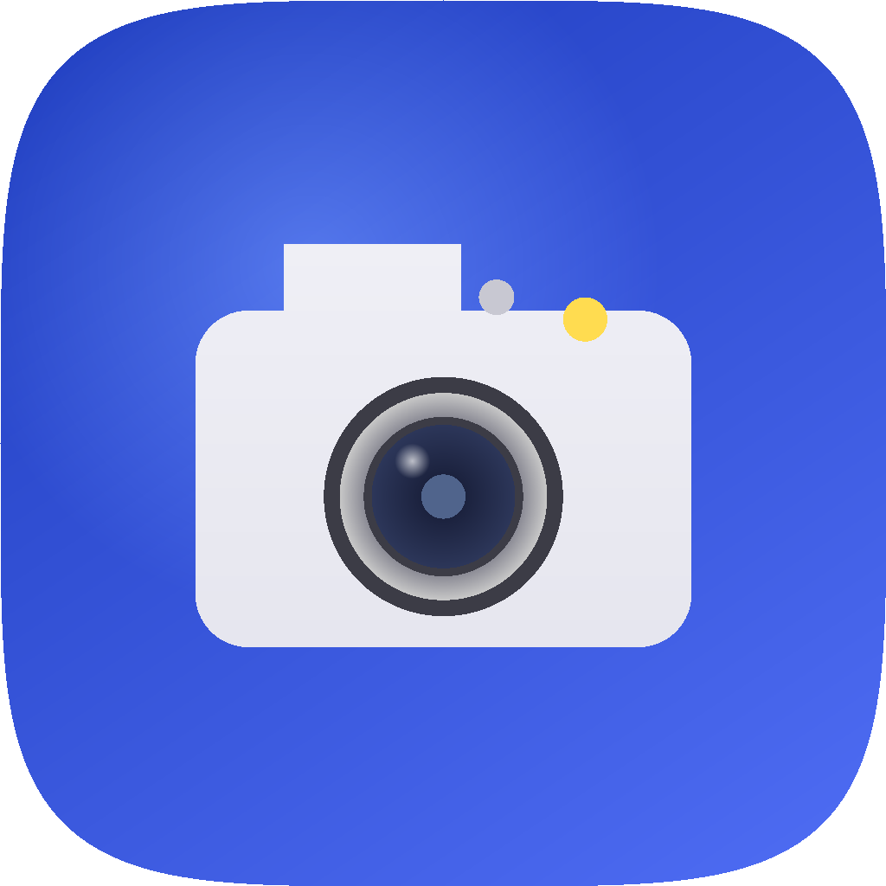

<p align="center">
  
</p>

<h1 align="center">OpenShot</h1>

<p align="center">
  <strong>Free, open-source screenshot &amp; screen recording for macOS.</strong><br>
  No subscriptions. No cloud. No tracking.
</p>

<p align="center">
  <a href="https://github.com/umutkeltek/OpenShot/actions/workflows/build.yml"></a>
  
  
  <a href="LICENSE"></a>
</p>

<p align="center">
  <a href="#features">Features</a> ·
  <a href="#openshot-vs-cleanshot-x-vs-shottr">Comparison</a> ·
  <a href="#screenshots">Screenshots</a> ·
  <a href="#installation">Installation</a> ·
  <a href="#keyboard-shortcuts">Shortcuts</a> ·
  <a href="#contributing">Contributing</a>
</p>

---

## OpenShot vs. CleanShot X vs. Shottr

CleanShot X and Shottr are both excellent, well-built tools — but each is a closed-source
paid product, and each is missing capabilities the other has. OpenShot combines the best
ideas from both, free and open source.

| | OpenShot | CleanShot X | Shottr |
|---|:---:|:---:|:---:|
| Price | **Free** (MIT) | $29 one-time + $10/mo cloud tiers | $8 one-time |
| Open source | **Yes** | No | No |
| Screen recording (MP4/GIF) | **Yes** | Yes | No |
| Smart text-only blur | **Yes** | No (pixelate only) | Yes |
| Pixel ruler / measurement | **Yes** | No | Yes |
| WCAG / APCA contrast checker | **Yes** | No | Yes |
| Quick Access Overlay (post-capture panel) | **Yes** | Yes | No |
| Cloud upload | No — by design | Yes (proprietary, paywalled) | S3 (bring your own bucket) |
| Telemetry / analytics | **None** | — | — |
| Annotation tools | **17** | ~15 | ~11 |

*Comparison based on each product's public feature pages as of this writing — verify
before relying on it, since competitor products change frequently.*

## Features

| | |
|---|---|
| 🖼️ **8 capture modes** | Area, window, fullscreen, scrolling, self-timer, freeze-screen, previous-area, All-in-One panel |
| ✏️ **17 annotation tools** | Arrows, shapes, text, blur/pixelate/smart-blur, spotlight, pixel ruler, color picker, magnifier, and more |
| 🎥 **Screen recording** | MP4 (H.264) and GIF, webcam overlay, click/keystroke visualization, pause/resume |
| 🔎 **On-device OCR** | Vision-powered text recognition — nothing ever leaves your Mac |
| 📌 **Quick Access Overlay** | Copy, save, annotate, pin, or drag-and-drop right after every capture |
| 🗂️ **Capture history** | SwiftData-backed grid with type filters |
| ⌨️ **Full automation** | Custom global hotkeys + `openshot://` URL scheme for Alfred, Raycast, Shortcuts |
| 🔒 **Privacy by design** | Zero network access, zero telemetry, zero external dependencies |

<details>
<summary><strong>Full feature breakdown</strong> (click to expand)</summary>

### Capture Modes
- **Area Capture** — Rubber-band selection with crosshair, magnifier loupe, and dimension labels
- **Window Capture** — Click any window; automatic transparency, shadow, and custom backgrounds (8 gradient presets, solid colors)
- **Fullscreen Capture** — Captures the display under your cursor (multi-monitor support)
- **Scrolling Capture** — Experimental vertical stitching for long pages
- **Self-Timer** — 3/5/10 second countdown before any capture
- **Freeze Screen** — Freeze the display to capture tooltips, menus, and hover states
- **Capture Previous Area** — Re-capture the exact same region with one shortcut
- **All-in-One Panel** — Single shortcut opens a floating panel with every capture mode

### Annotation Editor
17 tools in a scrollable toolbar:

| Tool | Description |
|------|-------------|
| Arrow | 4 styles including curved, with optional hand-drawn look |
| Rectangle | Outline or filled, optional hand-drawn style |
| Ellipse | Outline or filled, optional hand-drawn style |
| Line | Straight line with configurable dash pattern |
| Text | 7 preset styles (pill, highlight, shadow, monospace, etc.) |
| Counter | Auto-incrementing numbered circles for step-by-step guides |
| Pencil | Freehand drawing with Catmull-Rom smoothing |
| Highlighter | Semi-transparent marker (multiply blend, 40% opacity) |
| Blur | CIGaussianBlur on selected region |
| Pixelate | CIPixellate with randomized offset (prevents de-pixelation) |
| Smart Blur | Vision-powered text-only blur — blurs text, preserves images |
| Spotlight | Dims everything except selected region |
| Black Out | Solid fill redaction |
| Crop | Crop to selection |
| Pixel Ruler | Measure distances in pixels with imprint support |
| Color Picker | Pick colors with HEX/RGB/OKLCH values + WCAG contrast checking |
| Magnifier | Circular zoom callout annotation |

Plus: **Rotate/Flip/Resize** via Image menu, **undo/redo**, **drag images in** to combine screenshots, and **hand-drawn style toggle**.

### Screen Recording
- **MP4 Recording** — H.264 via SCStream + AVAssetWriter, 30/60 FPS
- **GIF Recording** — Real-time capture with automatic downsampling to 640px
- **Audio** — System audio + microphone
- **Webcam Overlay** — Circular camera preview in floating panel
- **Click Visualization** — Expanding colored circles on mouse clicks
- **Keystroke Visualization** — Floating pill showing pressed keys
- **Recording Controls** — Pause, resume, restart, stop with elapsed timer
- **Menu Bar Timer** — Shows MM:SS elapsed time during recording
- **Do Not Disturb** — Auto-enabled during recording

### Quick Access Overlay
Floating panel appears after every capture with:
- **Copy** — Image data + temp file URL to clipboard
- **Save** — To configured folder in PNG/JPEG/TIFF/WebP/HEIC
- **Annotate** — Opens full annotation editor
- **Pin** — Creates always-on-top floating screenshot
- **Drag & Drop** — Drag thumbnail directly into any app
- **Auto-close** — Configurable delay (3s/5s/10s/never), pauses on hover
- **Restore Recently Closed** — Bring back accidentally dismissed captures

### OCR
- On-device text recognition via Vision framework
- `.accurate` recognition level with language correction
- Preserves line breaks from bounding box positions
- Result copied directly to clipboard

### Floating Screenshots
- Always-on-top display
- Resizable with aspect ratio lock
- Adjustable opacity (20-100%)
- Lock mode (click-through)
- Arrow keys for pixel-precise positioning
- Double-click to open in annotation editor

### Additional Features
- **Desktop Icon Hiding** — Toggle or auto-hide during capture
- **Custom File Naming** — Templates with `{date}`, `{time}`, `{mode}`, `{counter}` tokens
- **Capture History** — SwiftData-backed grid with type filters
- **URL Scheme** — `openshot://capture-area`, `openshot://record-screen`, etc.
- **Launch at Login** — Via SMAppService
- **First-Run Onboarding** — Permission request + shortcut overview
- **WCAG Contrast Checker** — AA/AAA pass/fail + APCA values

</details>

## Screenshots

Real screenshots/GIFs of the app in action are a tracked follow-up, not included yet
so this section doesn't ship broken image links. Planned:

- Hero GIF: area capture → annotate → Quick Access Overlay → copy
- Annotation editor with several tools visible at once
- Window capture with a gradient background applied
- Quick Access Overlay, isolated
- Capture History grid with filters
- Settings → Shortcuts tab
- Smart Blur and Pixel Ruler in action (the two features called out in the comparison table above)

Once captured, drop them in `.github/readme/` and replace this section with the images.

## Installation

OpenShot doesn't yet ship a signed, notarized `.app`/`.dmg` — there's no release
pipeline beyond CI build+test (see [`.github/workflows/build.yml`](.github/workflows/build.yml)).
Building from source is the supported path today.

**Requirements:** macOS 14.0+ (Sonoma), Xcode 15+. Zero external dependencies —
pure Apple frameworks.

```bash
git clone https://github.com/umutkeltek/OpenShot.git
cd OpenShot
open OpenShot.xcodeproj   # Cmd+R to build and run
```

Or from the command line: `make build && make run`.

On first launch, grant **Screen Recording** permission (System Settings → Privacy
& Security → Screen Recording) — macOS will quit and reopen the app automatically
after you grant it, which is expected. OpenShot lives in your **menu bar** — there
is no dock icon.

## Keyboard Shortcuts

Every default shortcut uses **⌃⇧⌘ (Control+Shift+Command)** plus a letter/number —
deliberately different from macOS's built-in `⇧⌘3/4/5` screenshot shortcuts so
OpenShot never conflicts with the system. All shortcuts are rebindable in
Settings → Shortcuts.

| Action | Default Shortcut |
|--------|-------------------|
| Capture Area | `⌃⇧⌘4` |
| Capture Window | `⌃⇧⌘5` |
| Capture Fullscreen | `⌃⇧⌘3` |
| Scrolling Capture | `⌃⇧⌘6` |
| Capture Previous Area | `⌃⇧⌘7` |
| Self-Timer Capture | `⌃⇧⌘8` |
| All-in-One Panel | `⌃⇧⌘A` |
| Record Screen | `⌃⇧⌘R` |
| Record GIF | `⌃⇧⌘G` |
| OCR — Capture Text | `⌃⇧⌘T` |
| Restore Recently Closed | `⌃⇧⌘Z` |
| Toggle Desktop Icons | `⌃⇧⌘D` |

## Architecture

<details>
<summary>Click to expand — module breakdown and framework usage</summary>

```
OpenShot/
├── App/              # App lifecycle, menu bar, permissions, URL scheme, onboarding,
│                       coordinators (Capture/Recording/GIF/OCR/History)
├── Capture/          # ScreenCaptureKit engine, area/window/fullscreen selectors,
│                       self-timer, All-in-One panel, window backgrounds
├── Annotation/       # NSView canvas, 17 tool types, hand-drawn styles,
│                       smart blur, pixel ruler, toolbar, editor window
├── Overlay/          # Quick Access Overlay, floating screenshots, drag source
├── Recording/        # SCStream recorder, GIF exporter, video editor,
│                       click/keystroke visualizers, webcam overlay
├── OCR/              # Vision framework text recognition
├── History/          # SwiftData capture log with grid view
├── Settings/         # Preferences, hotkey manager, 6-tab Settings UI
├── Utilities/        # NSImage extensions, screen info, sound effects, clipboard
│                       service, desktop manager, color inspector, file namer, DND
└── Resources/        # Info.plist, entitlements, asset catalogs
```

**~55 Swift files, ~12,000 lines of code.** Zero external dependencies.

| Framework | Usage |
|-----------|-------|
| ScreenCaptureKit | Screen capture and recording |
| AVFoundation | Video encoding, webcam, audio |
| Vision | OCR text recognition, smart text blur |
| CoreImage | Blur, pixelate, image filters |
| CoreGraphics | Annotation drawing, image composition |
| AppKit | Windows, panels, overlays, menus |
| SwiftUI | Settings, toolbar, overlay, history |
| SwiftData | Capture history persistence |
| ServiceManagement | Launch at login |

See [docs/ARCHITECTURE.md](docs/ARCHITECTURE.md) for the full breakdown and data-flow diagrams.

</details>

## URL Scheme

Automate OpenShot from Alfred, Raycast, Shortcuts, or scripts:

```
openshot://capture-area
openshot://capture-window
openshot://capture-fullscreen
openshot://scrolling-capture
openshot://record-screen
openshot://record-gif
openshot://capture-text
openshot://open-history
openshot://toggle-desktop-icons
openshot://restore-recently-closed
```

## Export Formats

| Format | Extension |
|--------|-----------|
| PNG | `.png` (default) |
| JPEG | `.jpeg` (quality configurable) |
| TIFF | `.tiff` |
| WebP | `.webp` |
| HEIC | `.heic` |
| MP4 | `.mp4` (recordings) |
| GIF | `.gif` (GIF recordings) |

## Documentation

| Document | Description |
|----------|-------------|
| [Architecture](docs/ARCHITECTURE.md) | Module breakdown, data flow, design decisions |
| [Development Guide](docs/DEVELOPMENT.md) | Setup, building, testing, debugging |
| [Contributing](CONTRIBUTING.md) | How to report bugs, suggest features, submit PRs |
| [Code of Conduct](CODE_OF_CONDUCT.md) | Community standards |
| [Security Policy](SECURITY.md) | Reporting vulnerabilities |
| [Changelog](CHANGELOG.md) | Release history |

## Contributing

We welcome contributions! See [CONTRIBUTING.md](CONTRIBUTING.md) for guidelines.

```bash
# Quick start
git clone https://github.com/umutkeltek/OpenShot.git
cd OpenShot
make build    # Build
make test     # Run tests
make run      # Build and launch
```

## License

[MIT](LICENSE) — do whatever you want with it.

Built with Swift and Apple frameworks. No subscriptions, no cloud, no tracking.
